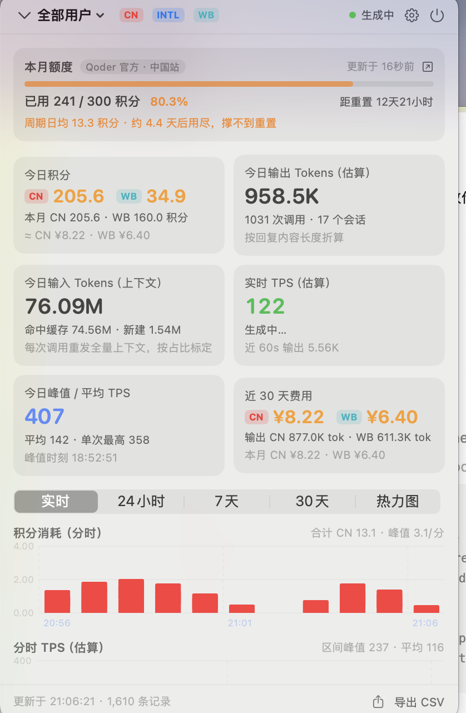
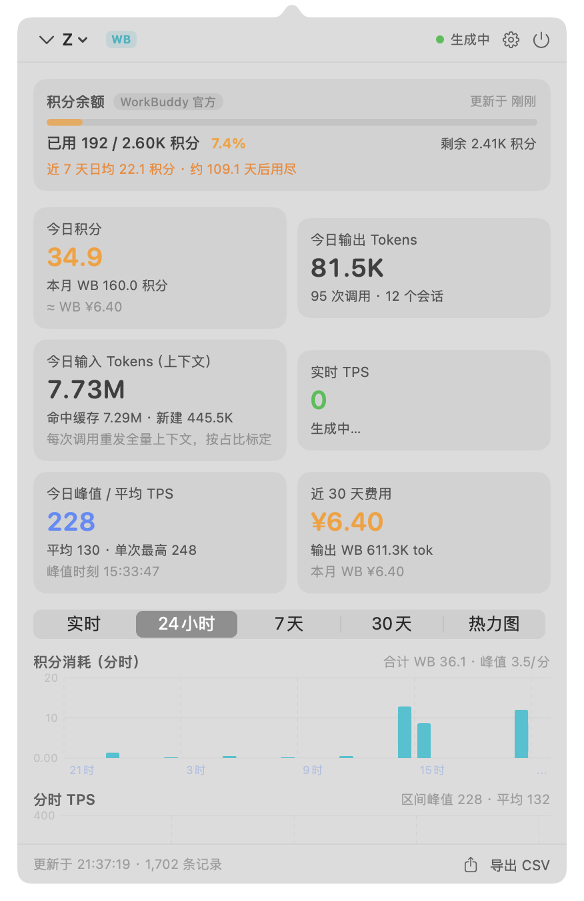
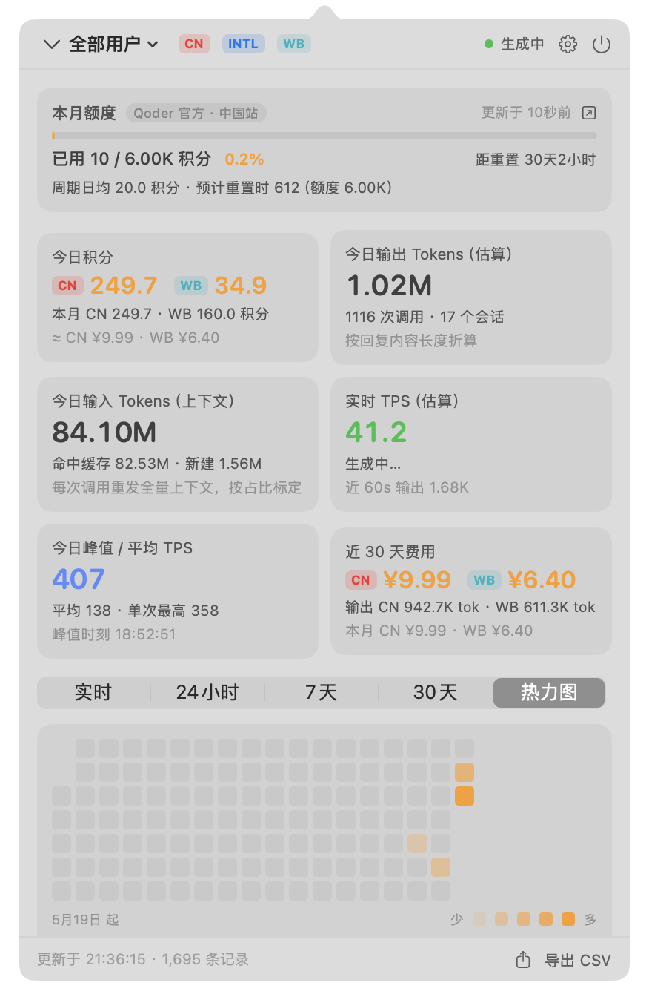
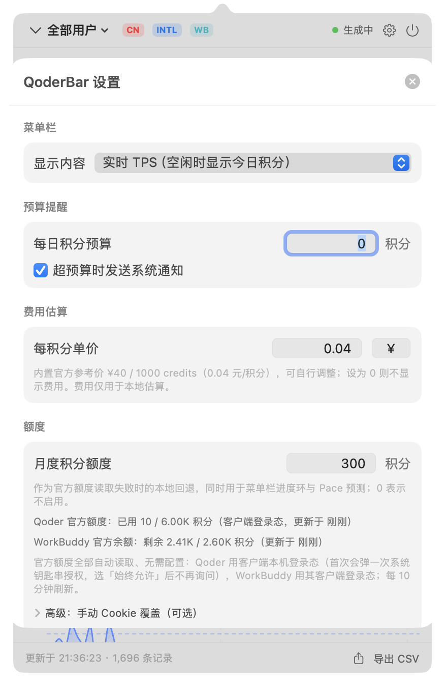

# QoderBar


**Qoder 与 WorkBuddy 用量菜单栏监控。** 全本地数据 + 官方额度自动读取：菜单栏一眼看到实时 TPS、积分消耗与额度余额，展开面板查看分时图表、热力图、会话/项目/模型维度统计。

> A macOS menu bar app that monitors local **Qoder** (CN & international) and **WorkBuddy** usage, and reads official quota/balance automatically from the installed clients' local login state — no API keys, no manual configuration, no data leaves your machine.



## 功能特性

- **官方额度自动读取（无需配置）**
  - Qoder：解密客户端本机登录态（钥匙串 `Qoder CN App Safe Storage` → `auth.v1.dat`）调用官方用量接口，展示**已用 / 总额度 / 百分比 / 重置倒计时**；首次会弹一次系统钥匙串授权（选「始终允许」即可）
  - WorkBuddy：读取其客户端登录态调用官方资源接口，展示**积分余额（已用 / 总计 / 剩余）**
  - **Pace 预测**：按计费周期日均消耗推算「能否撑到重置 / 约几天后耗尽」
- **额度卡跟随所选账号**：切到 WorkBuddy 账号就显示 WorkBuddy 的余额，切回 Qoder 显示 Qoder 额度
- **分产品分账**：Qoder 与 WorkBuddy 的积分 / 费用**不跨产品相加**，卡片与图表一律分列展示
- **菜单栏用量表**：图标为额度进度环（正常单色 / 接近橙色 / 超限红色），可切换标题显示实时 TPS、今日积分、Tokens 或费用
- **实时指标**：近 60s 实时 TPS、滑动窗口峰值 TPS、调用时长加权平均 TPS、"生成中"状态
- **分时图表 + 热力图**：积分消耗（按产品堆叠）、TPS 曲线，实时 / 24 小时 / 7 天 / 30 天 / 120 天热力图
- **多维度统计**：会话（可展开详情）、项目、模型聚合；多用户按登录时间线隔离
- **费用估算**：内置官方参考价（¥40 / 1000 credits），可自定义单价与币种
- **预算提醒**：每日积分预算超限发系统通知
- **CSV 导出 / 开机自启 / 隐藏无数据用户**
- **自动更新（GitHub Releases）**：启动后静默检查（每日一次节流）+ 设置页手动「检查更新」；发现新版本可选「下载并安装 / 稍后 / 跳过此版本」。更新只访问 GitHub，下载后做 **sha256（发布页同名资产）+ 代码签名/包标识** 双重校验，任一不符拒绝安装
- **CLI**：`--dump` 自检报告、`--json` 机器可读输出、`--quota-test` 额度链路诊断、`--check-update` 更新检查

| WorkBuddy 账号视图 | 热力图 | 设置 |
| --- | --- | --- |
|  |  |  |

## 数据来源与工作原理

所有统计均来自本机文件，增量为准实时（写入过程中即近实时入库）：

| 数据 | 位置 |
| --- | --- |
| Qoder CN / 国际版会话 | `~/.qoder-cn/projects/**/*.jsonl`、`~/.qoder/projects/**/*.jsonl` |
| Qoder 登录状态 | `~/.qoder-cn/.qoder-app-status.json`、`main.sqlite` 的 `account_profiles` |
| WorkBuddy 会话 | `~/.workbuddy/projects/**/*.jsonl`（桌面版）、`~/.codebuddy/projects/**/*.jsonl`（内置 CLI） |
| WorkBuddy 登录态 | `~/Library/Application Support/CodeBuddyExtension/Data/Public/auth/workbuddy-desktop.info` |
| Qoder 客户端登录态 | `~/Library/Application Support/com.qodercn.app.stable/auth.v1.dat`（Electron safeStorage 加密，密钥存钥匙串） |
| 本地索引库 | `~/Library/Application Support/QoderBar/usage.sqlite` |

官方额度接口（每 10 分钟自动刷新，仅这两个外部请求）：

- Qoder：`GET https://openapi.qoder.com.cn/sash/api/v2/me/usage`（Bearer，取 `qoderUsage.userQuota`）
- WorkBuddy：`POST https://copilot.tencent.com/billing/meter/get-user-resource-summary`（Bearer，汇总 `Packages`）

### 统计口径

- **积分（credits）** 是服务端返回的真实计量值，精确统计
- **WorkBuddy 的 tokens** 为服务端真实值；**Qoder CN 的 tokens / TPS 为估算值**（服务端不返回 token 数，按回复内容长度折算：CJK × 0.75，其他 ÷ 4）
- 额度类数字（已用/剩余/重置时间）以官方接口为准；本地会话文件只保留近期记录，本地汇总可能小于官方累计
- 单次调用时长由相邻消息时间差推导；多用户归属按账号登录时间窗口划分

## 隐私与权限

- **纯本地**：不上传任何数据；除上述两个官方额度接口外无网络请求
- **凭据**：登录 token 仅在内存中用于本机请求，**不落盘、不打印、不上传**；Qoder 侧需要一次性钥匙串授权，WorkBuddy 侧直接读取其客户端已有登录态
- 无 Dock 图标、无屏幕录制、无辅助功能权限
- 可通过设置中的「高级」手动覆盖 Cookie（仅国际站或自动读取失败时需要）

## 安装（普通用户）

1. 从 [Releases](../../releases) 下载 `QoderBar-x.y.z.zip`，解压得到 `QoderBar.app`
2. 拖入「应用程序」文件夹
3. **首次打开**：在 Finder 中右键点击 App → 「打开」→ 确认（应用未做 Apple 公证，只需这一次；或在 系统设置 → 隐私与安全性 中点「仍要打开」）
4. 首次启动会**自动展开面板**；按面板提示在钥匙串授权弹窗中输入开机密码并点「**始终允许**」（仅 Qoder 额度读取需要，之后不再询问；点「拒绝」也能正常看本地用量）

用户总共需要操作的权限就这些：① 首次打开的确认；② 一次钥匙串授权（可拒绝，仅影响 Qoder 官方额度显示）；③（可选）通知权限。**不需要**全盘访问、屏幕录制、辅助功能等任何系统权限——所有数据都在本机读取。

## 从源码构建（开发者）

要求：macOS 14+、Xcode Command Line Tools（`xcode-select --install`，无需完整 Xcode）。

```bash
git clone <repo-url> && cd qoderbar
./scripts/build-app.sh release        # 构建 dist/QoderBar.app（ad-hoc 签名）
open dist/QoderBar.app
```

> 说明：`scripts/build-app.sh` 会强制使用 `MacOSX26.5.sdk` 构建（CLT 的 SwiftUI 宏插件在该 SDK 下可用），可用 `SDKROOT` 环境变量覆盖。

## 发布新版本（维护者）

```bash
./scripts/release.sh                  # 构建 + 打包 dist/QoderBar-x.y.z.zip（含 sha256）
```

把 zip 上传到 GitHub Releases 即可。如需免去用户"右键打开"的一步，用 Apple 开发者账号做 Developer ID 签名 + 公证：

```bash
SIGN_IDENTITY="Developer ID Application: Xxx (TEAMID)" ./scripts/release.sh
xcrun notarytool submit dist/QoderBar-x.y.z.zip --keychain-profile <profile> --wait
xcrun stapler staple dist/QoderBar.app
```

### 更新机制与安全

自动更新只使用 **GitHub Releases** 作为信任源（不引入自建更新服务器）：

1. `GET api.github.com/repos/{owner}/{repo}/releases/latest` 对比版本号（24 小时节流，可在设置中关闭）
2. 仅从 `github.com` / `*.githubusercontent.com` 下载 `QoderBar-<版本>.zip`（其它域名一律拒绝）
3. 校验发布页同名的 `.sha256` 资产（`release.sh` 会生成，需一并上传）
4. 校验解压产物的代码签名：`codesign --verify --deep --strict` + 包标识一致；若当前应用与更新包都有 TeamIdentifier 还必须一致
5. 全部通过后才原地替换并重启；校验失败、无 hash、无权限都会明确提示并回退到手动安装

> 更强的防篡改（即使在 GitHub 账号被盗的情况下也无法伪造更新）需要 Developer ID 签名 + Sparkle EdDSA，属于后续可选项。

### 命令行

```bash
dist/QoderBar.app/Contents/MacOS/QoderBar --help        # 帮助
dist/QoderBar.app/Contents/MacOS/QoderBar --dump        # 数据自检报告
dist/QoderBar.app/Contents/MacOS/QoderBar --json        # 机器可读 JSON（含分产品与额度）
dist/QoderBar.app/Contents/MacOS/QoderBar --quota-test  # 额度抓取链路诊断
```

### 测试

```bash
./scripts/test.sh
```

## 项目结构

```
Sources/QoderBar/
├── QoderBarMain.swift        # 入口（@main）与 CLI 分发
├── AppDelegate.swift
├── Core/                     # 数据与网络：扫描器、引擎、SQLite、指标、额度、CLI
├── Support/                  # 模型、格式化等基础件
└── UI/                       # SwiftUI 面板、菜单栏控制器、设置
Tests/QoderBarTests/          # Swift Testing 单元测试（解析 / 聚合 / 格式化）
scripts/                      # build-app.sh / test.sh
```

## 已知限制与 Roadmap

- Qoder 国际站（qoder.com）的客户端凭据路径未实测，国际站可先用高级选项手动粘贴 Cookie
- Qoder CN 的 token 量为估算值（服务端限制）
- 暂无自动更新与多语言（中文 UI）
- Roadmap：更多产品数据源、周/月报表、导出图片分享

## 致谢

- 设计灵感来自 [CodexBar](https://github.com/steipete/CodexBar)（额度窗口 / 重置倒计时 / Pace 预测 / 菜单栏仪表）
- 本项目为非官方工具，与 Qoder、WorkBuddy 官方无关联

## License

[MIT](LICENSE) — 允许商用、修改、再分发；保留版权声明与许可证文本即可。不含专利条款与商标授权（项目名称与图标仍归作者）。

本项目为独立实现，未复制第三方代码（设计灵感见「致谢」）。
